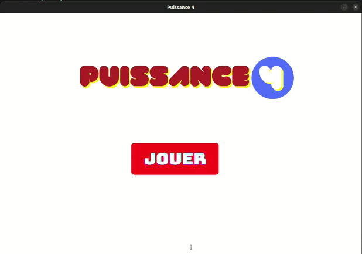

# Connect 4 - Game [v1]
<br/>
Connect 4 is a two-player connection board game, in which the players choose a color and then take turns dropping colored tokens into a seven-column, six-row vertically suspended grid. The pieces fall straight down, occupying the lowest available space within the column. The objective of the game is to be the first to form a horizontal, vertical, or diagonal line of four of one's own tokens. 

## 0. Prerequisites
* Python 3+ and pip installed

## 1. Quick Start

1. Install pygame :
```
pip install pygame
```
2. Run main.py

## 2. Demo


## 3. To complete 
 
- [ ] Settings
- [ ] Hint